# 👋 Hey, I'm Jasim Saad P A

```text
╔════════════════════════════════════════════════════════════╗
║                                                            ║
║                  ~/Jasim-Saad-P-A $ whoami                 ║
║                                                            ║
║          Full-Stack Developer • AI/ML Enthusiast           ║
║                                                            ║
╚════════════════════════════════════════════════════════════╝
```

I'm a Computer Science student who enjoys building real-world
applications and exploring the intersection of **full-stack development
and AI**.

I like understanding how things work from the UI all the way to the
backend, APIs, databases, and AI systems.

---

## `$ cat about.txt`

```text
name        : Jasim Saad P A
role        : Full-Stack Developer
focus       : Web Development · AI/ML · Backend Systems
frontend    : React · JavaScript · Tailwind CSS
backend     : Node.js · Express.js
database    : MongoDB
ai/ml       : Python · TensorFlow · scikit-learn
learning    : Java · DSA · System Design
location    : India 🇮🇳
```

---

## `$ ls -la current_focus/`

```text
🌐  Full-Stack Web Development
🤖  AI-powered Applications
⚛️  React & Frontend Engineering
🔧  Backend & REST API Development
🗄️  MongoDB & Database Design
🧠  Machine Learning
📚  Data Structures & Algorithms
```
---

---

## `$ cat tech_stack.txt`

### ⚛️ Frontend

<p>
  
</p>

### ⚙️ Backend

<p>
  
</p>

### 🗄️ Database

<p>
  
</p>

### 🤖 AI / ML

<p>
  
</p>

### ☕ Programming

<p>
  
</p>

### 🛠️ Tools

<p>
  
</p>---

# 🚀 Featured Projects

## 📚 English Examination Platform

**Team Project — Frontend Developer**

A web-based examination platform where I contributed extensively
to the React frontend.

### My Contributions

- React frontend development
- Admin interfaces
- Authentication-related frontend flows
- Protected routes
- React Router
- Examination environment
- Responsive UI
- PWA configuration
- Vite and Tailwind CSS configuration

**Tech:** `React` `JavaScript` `Tailwind CSS` `Vite` `PWA`

🔗 [View Repository](https://github.com/Jasim-Saad-P-A/English_Examination_Platform)

---

## 🤖 Jarvis — Python Voice Assistant

A Python-based personal assistant for voice-driven commands,
desktop automation, web actions and system controls.

### Features

- Voice command recognition
- Text-to-speech responses
- Desktop automation
- Web browsing commands
- Application launching
- Window and system controls

**Tech:** `Python` `SpeechRecognition` `pyttsx3` `PyAutoGUI`

🔗 [View Repository](https://github.com/Jasim-Saad-P-A/Jarvis)

---

## 🤖 AI / ML Projects

Exploring AI and machine learning through practical projects
using Python, TensorFlow and scikit-learn.

My current focus is on building applications that combine
AI capabilities with full-stack web development.

🔗 [View My Repositories](https://github.com/Jasim-Saad-P-A?tab=repositories)

---

## `$ tree currently_learning/`

```text
Java
└── Data Structures & Algorithms
    ├── Arrays & Strings
    ├── Hashing
    ├── Stack & Queue
    ├── Trees
    ├── Graphs
    └── Problem Solving

Full-Stack Development
├── React
├── Node.js
├── Express.js
└── MongoDB

AI / ML
├── Machine Learning
├── Deep Learning
└── AI Application Development

Engineering
├── REST API Design
├── Authentication
└── System Design Fundamentals
```
---

## `$ cat goals_2026.txt`

```text
[ ] Build production-quality full-stack applications
[ ] Build and deploy AI-powered applications
[ ] Strengthen Java & DSA problem solving
[ ] Improve backend and API development
[ ] Learn system design fundamentals
[ ] Contribute to open source
[ ] Build a strong developer portfolio
```

---

## `$ git status`

```text
On branch main

Current focus:
  → Full-Stack Development
  → AI / ML
  → Java & DSA
  → Backend Engineering

Status:
  🚀 Building
  🧠 Learning
  🔧 Experimenting
```
---

## `$ ./connect.sh`

```text
Interested in:
  → Full-Stack Development
  → AI / ML
  → Open Source
  → Software Engineering

Feel free to connect, collaborate, or discuss interesting projects.
```

### 🌐 Find Me Online

- 💼 **LinkedIn:** [Jasim Saad P A](https://www.linkedin.com/in/jasim-saad-6b2830327/)
- 🐙 **GitHub:** [@Jasim-Saad-P-A](https://github.com/Jasim-Saad-P-A)

## `$ git stats`

<p align="center">
  
  
</p>

```text

╔════════════════════════════════════════════════════════════╗
 ║                                                          ║
  ║          Build. Break. Learn. Build Again. 🚀         ║
 ║                                                          ║
╚════════════════════════════════════════════════════════════╝
```
